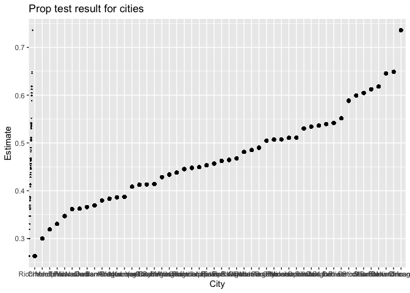
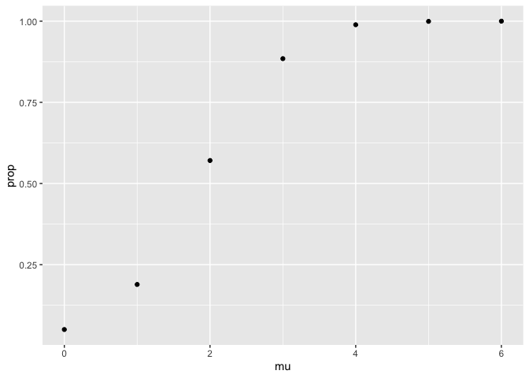
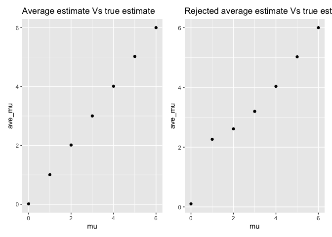

P8105 hw5
================
Qingzhen Sun
2022-11-16

``` r
library(tidyverse)
```

    ## ── Attaching packages ─────────────────────────────────────── tidyverse 1.3.2 ──
    ## ✔ ggplot2 3.3.6      ✔ purrr   0.3.4 
    ## ✔ tibble  3.1.8      ✔ dplyr   1.0.10
    ## ✔ tidyr   1.2.1      ✔ stringr 1.4.1 
    ## ✔ readr   2.1.2      ✔ forcats 0.5.2 
    ## ── Conflicts ────────────────────────────────────────── tidyverse_conflicts() ──
    ## ✖ dplyr::filter() masks stats::filter()
    ## ✖ dplyr::lag()    masks stats::lag()

``` r
library(readr)
library(patchwork)
```

## Problem 2

#### Load the raw data, and discrible the raw data.

``` r
urlfile = "https://raw.githubusercontent.com/washingtonpost/data-homicides/master/homicide-data.csv"
homi_data = read_csv(url(urlfile))%>%
  janitor::clean_names()
```

    ## Rows: 52179 Columns: 12
    ## ── Column specification ────────────────────────────────────────────────────────
    ## Delimiter: ","
    ## chr (9): uid, victim_last, victim_first, victim_race, victim_age, victim_sex...
    ## dbl (3): reported_date, lat, lon
    ## 
    ## ℹ Use `spec()` to retrieve the full column specification for this data.
    ## ℹ Specify the column types or set `show_col_types = FALSE` to quiet this message.

``` r
dim(homi_data)
```

    ## [1] 52179    12

The raw data includes 12 columns and 52179 rows, and some useful
variables like city, state and disposition.This dataset basically tells
the homicide of the Washington area. \#### Create city_state variable
and group by table shows the solved and unsolved cases.

``` r
tidy_homi = homi_data%>%
  mutate(city_state = str_c(city, ",", state))%>%
  group_by(city_state)%>%
  summarise(
    total_homi = n(),
    unsolved = sum(disposition == "Closed without arrest"| disposition == "Open/No arrest")
  )
```

#### Focus on the analysis of MD state.

``` r
Bal_data = homi_data%>%
  filter(city == "Baltimore")%>%
  mutate(result = ifelse(disposition == "Closed without arrest"| disposition == "Open/No arrest", 1,0))
Bal_result = prop.test(sum(Bal_data$result), length(Bal_data$result))%>%
  broom::tidy()%>%
  select(estimate, conf.low, conf.high)%>%
  save(file = "result/Bal_result.RData")
```

#### Create the prop test function and applied on every cities.

``` r
prop_func = function(x){
  city_data = homi_data%>%
    filter(city == x)%>%
    mutate(result = ifelse(disposition == "Closed without arrest"| disposition == "Open/No arrest", 1,0))
  city_result = prop.test(sum(city_data$result), length(city_data$result))%>%
    broom::tidy()%>%
    select(estimate, conf.low, conf.high)
  city_result
}

prop_result = expand_grid(city_name = homi_data$city)%>%
  mutate(prop_test = map(city_name, prop_func))%>%
  unnest(prop_test)
```

#### Plot the Prop test result through ggplot.

``` r
prop_result%>%
  ggplot(aes(x = reorder(city_name, estimate), y = estimate))+
  geom_point()+
  geom_errorbar(aes(xmin = conf.low, xmax = conf.high))+
  labs(x = "City",
       y = "Estimate",
       title = "Prop test result for cities")
```

<!-- -->

## Problem 3

#### test the t test function for mean = 0.

``` r
t_func = function(x){
  samples = tibble(rnorm(n = 30, mean = x, sd = 5))
  t_result =  t.test(samples)%>%
    broom::tidy()%>%
    select(estimate, p.value)
  t_result
}

mu_0 = expand_grid(mu = 0, iteration = 1:5000)%>%
  mutate(result = map(mu, t_func))%>%
  unnest(result)
```

#### Record the t test value for mean equals to 0 to 6.

``` r
mu_0_6 = expand_grid(mu = 0:6, iteration = 1:5000)%>%
  mutate(result = map(mu, t_func))%>%
  unnest(result)
```

``` r
mu_plot1 = mu_0_6%>%
  group_by(mu)%>%
  summarise( prop = sum(p.value < 0.05)/5000)%>%
  ggplot(aes(x = mu, y = prop))+
  geom_point()
mu_plot1
```

<!-- --> The
association between power and size is positive, since the plot graph
shows a positive linaer regression result.

``` r
mu_plot2 = mu_0_6%>%
  group_by(mu)%>%
  summarise( ave_mu = mean(estimate), na.rm = T)%>%
  ggplot(aes(x = mu , y = ave_mu))+
  geom_point()+
  labs(title = "Average estimate Vs true estimate")


mu_plot3 = mu_0_6%>%
  group_by(mu)%>%
  filter(p.value < 0.05)%>%
  summarise( ave_mu = mean(estimate), na.rm = T)%>%
  ggplot(aes(x = mu , y = ave_mu))+
  geom_point()+
  labs(title = "Rejected average estimate Vs true estimate")
mu_plot2 + mu_plot3
```

<!-- -->

the sample average of mu across tests for which the null is rejected
approximately equal to the true value of mu, since the plot3 which
indicated the result of rejected estimate shows a linear regression ,
and the slope is around one.
